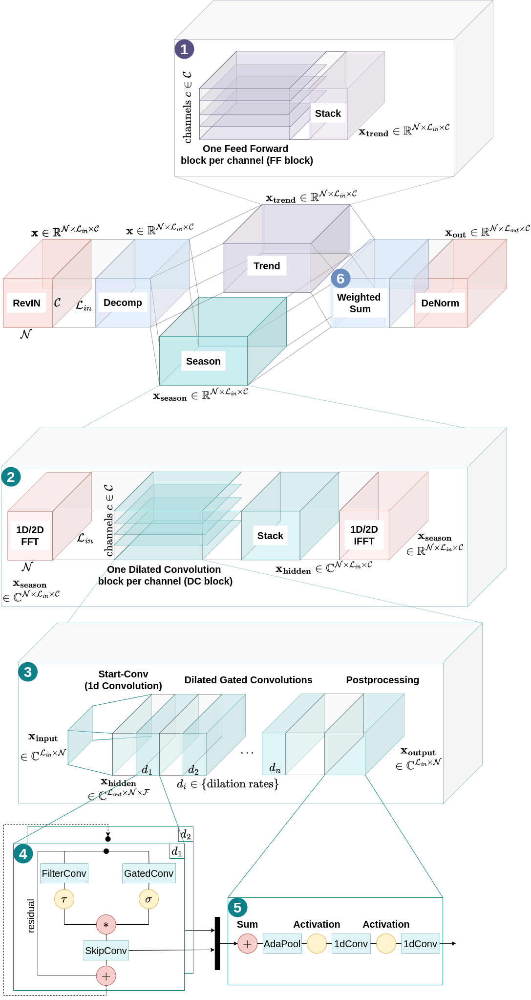

# TimeFlex

This repository contains code and resources related to the scientific paper titled 
"Tailored Architectures for Time Series Forecasting:
Evaluating Deep Learning Models on Gaussian
Process-Generated Data". It includes the scripts, datasets, and environment setup necessary to 
reproduce the experiments and results presented in the paper.

## Table of Contents

1. [Repository Structure](#repository-structure)
2. [Datasets and Data Manager](#datasets-and-data-manager)
3. [Environment Setup](#environment-setup)
4. [Running the Scripts](#running-the-scripts)
5. [Model Overview](#model-overview)
6. [Training Settings](#training-settings)
7. [Results](#results)
8. [References](#references)
9. [Acknowledgments](#acknowledgments)

## Repository Structure

The repository is organized as follows: 
- `key_files`: Stores figures and applied scalers.
- `scripts`: Contains shell scripts for running experiments and executing training.
  - `benchmarking_datasets` and `sampled_datasets`: Each folder includes scripts for different models with their respective parameter settings. 
- `src`: Main codebase for the project. 
  - `data`: All datasets. 
  - `data_loader`: General time series data loaders, along with adapted loaders for _CycleNet_ [2] and _WaveMask_ [3]. 
  - `evaluation`: Provides classes for experiment evaluation. 
  - `experiments`: 
    - `exec_entry.py`: Entry point to execute training. 
    - `executor.py`: Contains the training class. 
    - `main.py`: Main function for running experiments. 
  - `models`: Implements models, with reusable layers in the `layers` module. 
  - `util`: Utility functions and helpers. 
- `environment.yml`: Conda environment configuration.

## Datasets and Data Manager

This project uses the following datasets:
- **Benchmarking**: _ETT_, _Traffic_, _Weather_, _Solar_, _Electricity_, _Exchange Rate_.
- **GP-Timeset**: _SE_, _Combined_, _Periodic_, _Locally Periodic_, _Rational Quadratic_.

### Add your own dataset
You can place your datasets in the `src/data/` folder and add the dataset specific parameters in `src/util/dataset_manager.py`. 
The `src/dataloader/timeseries_data_loader.py` script is responsible for loading and preprocessing these datasets. 
You can modify it according to your needs.

To add a new dataset to the project, follow these steps:

1. **Place the Dataset File:**
   - Place the dataset file in the `src/data/` directory.

2. **Add Dataset to the _Dataset Manager_:**
   - There are 3 distinct data loaders: 
     - **DatasetTimeseries** for most models
     ```python
     considered_datasets = {'traffic': DatasetTimeseries}
     ```
     - **DatasetTimeseriesCycle** for the _CycleNet_ model 
     ```python
     cycle_datasets = {'traffic': DatasetTimeseriesCycle}
     ```
     - **DatasetTimeseriesWave** for the _WaveMask_ model
     ```python
     mask_datasets = {'traffic': DatasetTimeseriesWave}
     ```

3. **Dataset-Specific Parameters:**
   - Each dataset requires specific parameters that should be added to the `dataset_params` dictionary, using the dataset name as the key:
   ```python
   dataset_params = {
       "traffic": {
           "freq": "h", "data_root_path": "data", ...
       }
   }

## Environment Setup

To run the experiments, you will need to set up a Python environment with the required dependencies. Follow these steps to set up your environment:

1. Clone the repository:
    ```bash
    git clone https://github.com/vicky-hnk/time-flex.git
    cd time-flex
    ```

2. Create a conda environment:
    ```bash
    conda env create -f environment.yml
    conda activate torch
    ```
   
3. Make sure you have all necessary system dependencies (e.g., CUDA for GPU support) if applicable. 

   Run the following command to get information about your GPU and CUDA version for Linux:
   ```bash
   nvidia-smi && nvcc --version && echo $CUDA_HOME
   ```
   and for Windows:
   ```bash
   nvidia-smi && nvcc --version && echo %CUDA_HOME%
   ```
   To check CUDA availability within your environment run:
    ```
    python3 src/util/check_cuda.py
    ```

## Running the Scripts
To execute the scripts, ensure that you have activated your conda environment (or any environment of your choice):

- **`run_all.sh`**: Runs training for all models and datasets.

    ```bash
    bash scripts/run_all.sh
    ```

- **`run_sampled.sh`**: Runs training for all models on the sampled dataset _GP-TimeSet_.

    ```bash
    bash scripts/run_sampled.sh
    ```

- **`run_bench.sh`**: Runs training for all models on standard benchmarking datasets.

    ```bash
    bash scripts/run_bench.sh
    ```
  
## Model Overview
The _TimeFlex_ model architecture for a channel independent processing is depicted in the following figure:



After optionally applying RevIN [1], the data undergoes a moving average decomposition to separate it into trend and seasonal components.

① The trend part is processed by stacked feed-forward layers in the time domain.

② The seasonal part is optionally transformed to the frequency domain using Fast Fourier Transform. 
A stacked Dilated Convolution block learns the seasonal patterns at different scales.

③ An exemplary Dilated Convolution block for one channel contains Gated Dilated Convolutions with exponentially increasing dilation rates.

④ The Gated Convolution for one dilation rate is structured according to [4].

⑤ Adaptive Pooling, Activation and 1D Convolutions are applied as post-processing to learn further non-linearities and transform the tensor to the desired output dimension.

⑥ The season and trend parts are combined using a weighted sum with learnable weights to learn the influence of the seasonal and trend part.

## Training Settings


### Model Configuration Parameters

| Parameter                  | Value                                      |
| -------------------------- |--------------------------------------------|
| Discard incomplete batches | drop last during testing                   |
| Input sequence length      | 96                                         |
| Training set size          | 70%                                        |
| Validation set size        | 20%                                        |
| Testing set size           | 10%                                        |
| Optimizer                  | Adam                                       |
| **Scheduler**              |                                            |
| Type                       | torch.optim.lr_scheduler.ReduceLROnPlateau |
| Patience                   | 2                                          |
| Factor                     | 0.1                                        |
| Mode                       | min                                        |
| **Early Stopping**         |                                            |
| Patience                   | 10                                         |
| Delta                      | 0.00001                                    |

### Model-specific Settings

[Hyperparameter Settings](parameter-settings.md)

## Results

[All results](results.md)


## References

[1] T. Kim, J. Kim, Y. Tae, C. Park, J.-H. Choi, and J. Choo, “Reversible instance normalization for accurate time-series forecasting against distribution shift,” *ICLR*, 2022.

[2] S. Lin, W. Lin, X. Hu, W. Wu, R. Mo, and H. Zhong, “CycleNet: Enhancing time series forecasting through modeling periodic patterns,” *NeurIPS*, 2024.

[3] D. Arabi, J. Bakhshaliyev, A. Coskuner, K. Madhusudhanan, and K. S. Uckardes, “Wave-Mask/Mix: Exploring wavelet-based augmentations for time series forecasting,” 2024. [Online]. Available: https://arxiv.org/abs/2408.10951

[4]  A. van den Oord, N. Kalchbrenner, L. Espeholt, K. Kavukcuoglu, O. Vinyals, and A. Graves, “Conditional image generation with PixelCNN decoders,” *NeurIPS*, vol. 29, 2016.

Further considered model architectures:

[5] S. Wang, H. Wu, X. Shi, T. Hu, H. Luo, L. Ma, J. Y. Zhang, and J. Zhou, “Timemixer: Decomposable multiscale mixing for time series forecasting,” *CoRR*, vol. abs/2405.14616, 2024.

[6] A. van den Oord, S. Dieleman, H. Zen, K. Simonyan, O. Vinyals, A. Graves, N. Kalchbrenner, A. Senior, and K. Kavukcuoglu, “Wavenet: A generative model for raw audio,” 2016. Available: [https://arxiv.org/abs/1609.03499](https://arxiv.org/abs/1609.03499).

[7] H. Wu, J. Xu, J. Wang, and M. Long, “Autoformer: Decomposition transformers with auto-correlation for long-term series forecasting,” in *NeurIPS*, 2021.

[8] T. Zhou, Z. Ma, Q. Wen, X. Wang, L. Sun, and R. Jin, “FEDformer: Frequency enhanced decomposed transformer for long-term series forecasting,” in *ICML*, 2022, pp. 27 268–27 286.

[9] Y. Zhang and J. Yan, “Crossformer: Transformer utilizing cross-dimension dependency for multivariate time series forecasting,” in *ICLR*, 2023.

[10] Y. Nie, N. H. Nguyen, P. Sinthong, and J. Kalagnanam, “A time series is worth 64 words: Long-term forecasting with transformers,” in *ICLR*, 2023.

[11] Y. Liu, T. Hu, H. Zhang, H. Wu, S. Wang, L. Ma, and M. Long, “iTransformer: Inverted transformers are effective for time series forecasting.”

[12] Y. Yang, Q. Zhu, and J. Chen, “Vcformer: Variable correlation transformer with inherent lagged correlation for multivariate time series forecasting,” in *IJCAI*, 2024, pp. 5335–5343.

[13] A. Das, W. Kong, A. Leach, S. K. Mathur, R. Sen, and R. Yu, “Long-term forecasting with tiDE: Time-series dense encoder,” *Transactions on Machine Learning Research*, 2023.

[14] S. Lin, W. Lin, W. Wu, H. Chen, and J. Yang, “SparSETSF: Modeling long-term time series forecasting with 1k parameters,” in *ICML*, 2024.

[15] S. Lin, W. Lin, X. Hu, W. Wu, R. Mo, and H. Zhong, “CycleNet: Enhancing time series forecasting through modeling periodic patterns,” in *NeurIPS*, 2024.

[16] A. Zeng, M. Chen, L. Zhang, and Q. Xu, “Are transformers effective for time series forecasting?” *AAAI*, vol. 37, no. 9, pp. 11 121–11 128, Jun. 2023.

## Acknowledgments

We would like to express our sincere thanks to the authors and contributors of [TSLib](https://github.com/thuml/Time-Series-Library) for their ongoing work in providing an extensive benchmarking platform for deep time series analysis.
