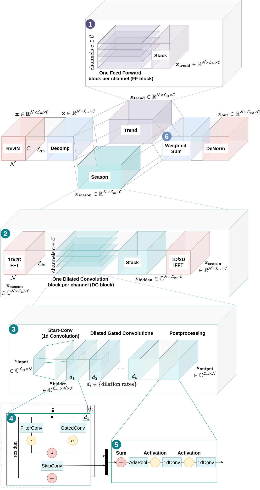

# TimeFlex

This repository contains code and resources related to the scientific paper titled 
"Tailored Architectures for Time Series Forecasting:
Evaluating Deep Learning Models on Gaussian
Process-Generated Data". It includes the scripts, datasets, and environment setup necessary to 
reproduce the experiments and results presented in the paper.

## Table of Contents

1. [Repository Structure](#repository-structure)
2. [Datasets and Data Manager](#datasets-and-data-manager)
3. [Environment Setup](#environment-setup)
4. [Running the Scripts](#running-the-scripts)
5. [Model Overview](#model-overview)
6. [Training Settings](#training-settings)
7. [Results](#results)

## Repository Structure

The repository is organized as follows:
* **key_files** is a file storage like the applied scaler
* **scripts** contains the shell scripts to run all experiments, i.e. execute the training:
  * The folders **benchmarking_datasets** and **sampled_datasets** contain one script per model with parameter settings for the argument parser
* **src** contains the main code base:
  * **data**: all datasets
  * **data_loader**: general time series dataloaders, and adapted ones for _CycleNet_ and _WaveMask_
  * **evaluation**: class for experiment evaluation
  * **experiments**: exec_entry.py is the entrypoint to execute training, executor.py contains the training class, main.py contains the main run function 
  * **models**: this module contains all model implementations, reusable layers can be found in the **layers** module   
  * **util**: utility module
* **environment.yml** for the conda environment

## Datasets and Data Manager

This project uses the following datasets (which can be found in src/data):

- **Benchmarking**: ETT, Traffic, Weather, Solar, Electricity, Exchange Rate.
- **GP-Timeset**: SE, Combined, Periodic, Locally Periodic, Rational Quadratic.

You can place your datasets in the `src/data/` folder and put the data parameters in util/dataset_manager.py. 
The `src/dataloader/timeseries_data_loader.py` script is responsible for loading and preprocessing these datasets. 
You can modify it according to your needs.

## Environment Setup

To run the experiments, you will need to set up a Python environment with the required dependencies. Follow these steps to set up your environment:

1. Clone the repository:
    ```bash
    git clone https://github.com/vicky-hnk/time-flex.git
    cd time-flex
    ```

2. Create a conda environment:
    ```bash
    conda env create -f environment.yml
    conda activate torch
    ```
   
3. Make sure you have all necessary system dependencies (e.g., CUDA for GPU support) if applicable. To check CUDA availability run:
    ```
   python3 src/util/check_cuda.py
    ```

## Running the Scripts

* `run_all.sh` executes training of all models and datasets.

    ```bash
    bash scripts/run_all.sh
    ```
  
* `run_sampled.sh` executes training of all models on the sampled dataset _GP-TimeSet_.

    ```bash
    bash scripts/run_all.sh
    ```
  
* `run_bench.sh` executes training of all models on common benchmarking datasets.

    ```bash
    bash scripts/run_all.sh
    ```
  
## Model Overview



## Training Settings


### Model Configuration Parameters

| Parameter                  | Value                                      |
| -------------------------- |--------------------------------------------|
| Discard incomplete batches | drop last during testing                   |
| Input sequence length      | 96                                         |
| Training set size          | 70%                                        |
| Validation set size        | 20%                                        |
| Testing set size           | 10%                                        |
| Optimizer                  | Adam                                       |
| **Scheduler**              |                                            |
| Type                       | torch.optim.lr_scheduler.ReduceLROnPlateau |
| Patience                   | 2                                          |
| Factor                     | 0.1                                        |
| Mode                       | min                                        |
| **Early Stopping**         |                                            |
| Patience                   | 10                                         |
| Delta                      | 0.00001                                    |

### Model-specific Settings

[Hyperparameter Settings](parameter-settings.md)

## Results

[All results](results.md)