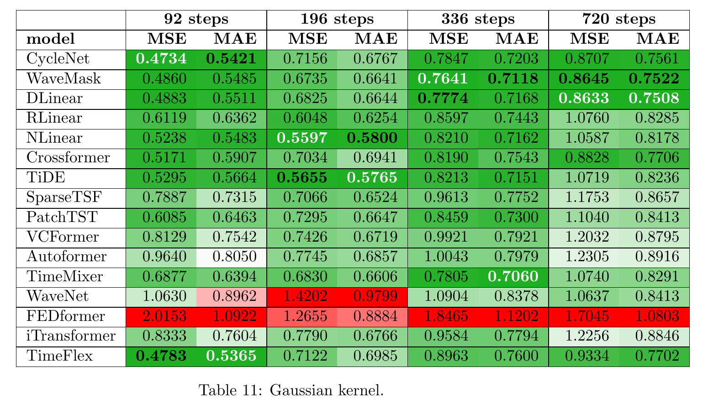
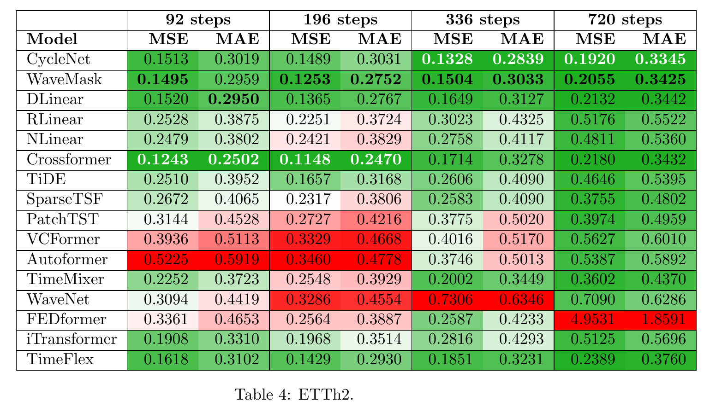
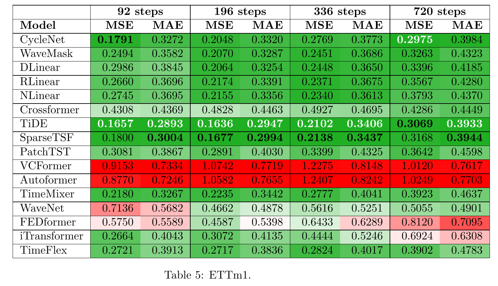

# Summary of all results

## Plots Paper

## MSE & MAE of all runs
The best results on the test data are highlighted as bold-white text and second best as bold-black. The table further employs a color-coded scale for shading of the cells, where green denotes the best values, white represents average values, and red indicates the worst values.

### GP-TimeSet

### Benchmark Datasets

